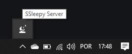

# SSleepy Server
Server to control Windows remotely.

<p align="center">
  
</p>

# Features
* Shutdown
* Restart
* Play
* Pause
* Next
* Previous
* Volume Up
* Volume Down
* Mute
* Close
* Fullscreen
* Mouse
* Left Click
* Right Click

# Prerequisites
* [Node.js](https://nodejs.org/en/)

# Running
### 1. Run
````
# Install dependencies
npm install

# Start
npm start
````

### 2. Build
````
# Package
npm run dist

# Get your version
dist/SSleepy Server-2.0.0-win.zip
````

# Example
````
curl --location --request POST 'http://localhost:1905/shutdown/'
curl --location --request POST 'http://localhost:1905/restart/'
curl --location --request POST 'http://localhost:1905/playpause/'
curl --location --request POST 'http://localhost:1905/next/'
curl --location --request POST 'http://localhost:1905/previous/'
curl --location --request POST 'http://localhost:1905/volumeup/'
curl --location --request POST 'http://localhost:1905/volumedown/'
curl --location --request POST 'http://localhost:1905/mute/'
curl --location --request POST 'http://localhost:1905/close/'
curl --location --request POST 'http://localhost:1905/fullscreen/'
curl --location --request POST 'http://localhost:1905/leftclick/'
curl --location --request POST 'http://localhost:1905/rightclick/'
````

# Built With
* [Node.js](https://nodejs.org/en/)
* [Electron](https://electronjs.org/)

# Authors
* [xxgicoxx](https://github.com/xxgicoxx)

# Acknowledgments
* [FlatIcon](https://www.flaticon.com/)